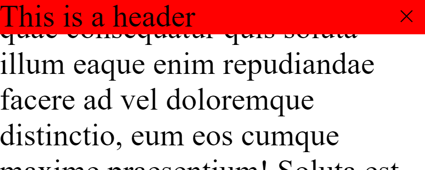
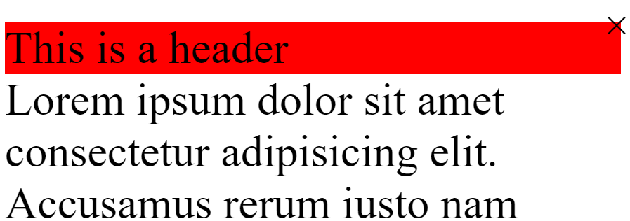

So you just heard about the newest CSS feature and you are dying to use it in your code, but your boss wants to support old browsers still. Normally this would be the end of the line for your dreams of using modern CSS features, but luckily that is not the case. The `@supports` at-rule, also known as a feature query, lets you use different CSS styles based on the browser's support for a given feature. This means you can finally use modern CSS features without breaking older browser support.

## Feature Query Syntax

For nearly all use cases a feature query has the same syntax as a media query. For example, a media query for a mobile view may look like this
```css
@media (max-width: 700px) {}
```
while a feature query that checks if CSS grid is supported would look like this
```css
@supports (display: grid) {}
```
The syntax is very similar and everything inside the curly brackets for the feature query will only apply if the browser supports the `grid` value for the `display` property. Also like media queries, feature queries support `and`, `or`, and `not` when defining queries. For example, the following code checks if the browser supports CSS grid and flexbox.
```css
@supports (display: grid) and (display: flex) {}
```

This query checks if the browser does **not** support position sticky.
```css
@supports not (position: sticky) {}
```

Lastly, this query can be used to check for the perspective property including any browser prefix support.

```css
@supports (perspective: 1px) or (-moz-perspective: 1px) or
          (-webkit-perspective: 1px) or (-ms-perspective: 1px) or
          (-o-perspective: 1px) {}
```

The syntax is quite straightforward, but the power of this simple feature query is immense.

## Feature Query Uses

One of the best use cases of the feature query is to allow newer browsers to use modern CSS which can improve the UI/UX for the end user while keeping everything working if the newer feature is not supported. One of my favorite properties to use this with is the sticky position property. This property is great at making table headers stick to the top of the page when scrolled, but it is not supported in all browsers. In order to ensure that the sticky headers will work in newer browsers while not breaking older browsers a feature query is needed. Here is an example set of HTML and CSS that does not use a feature query.

```html
<div>
  <div class="sticky">
    This is a header
    <div class="close-button">&times;</div>
  </div>
  <div>This is the content...</div>
</div>
```

```css
.sticky {
  position: sticky;
  top: 0;
  background-color: red;
}

.close-button {
  position: absolute;
  top: 5px;
  right: 5px;
}
```

In a browser that supports the position sticky the page will look like this which is correct.



In a browser that does not support the sticky position property, though, the close button will be incorrectly positioned absolutely based on the html element and not the sticky header element.



This is because position sticky works like position relative and will force position absolute children to be relative to them, but since the browser does not support position sticky all absolute children are being positioned relative to the html element.

In order to fix this, the following CSS can be used.

```css
.sticky {
  position: sticky;
  top: 0;
  background-color: red;
}


@supports not (position: sticky) {
  .sticky {
    position: relative;
  }
}

.close-button {
  position: absolute;
  top: 5px;
  right: 5px;
}
```

Now all `.sticky` elements will default to position relative when sticky position is not supported. This means that the close button will be properly positioned in all browsers, and all browsers that support position sticky will get the sticky header when scrolling.

This is an incredibly easy way to add modern CSS features into projects that require older browser support, so that the majority of users on modern browsers can have the best UI/UX possible.

## Browser Support

Of course, when talking about cool features in web development we have to talk about the dreaded browser support. Luckily, feature queries are well supported across all major browsers with an overall [95.86% support](https://caniuse.com/#feat=css-featurequeries). The only browser that is not supported is Internet Explorer which is a bit of a bummer since Internet Explorer is one of the browsers that would benefit the most from feature queries

## Conclusion

In conclusion feature queries are a powerful tool that can be used to write modern CSS without breaking older browsers. This means the next time a cool new CSS feature comes out you can start using it immediately without having to wait years for the browser support to catch up.