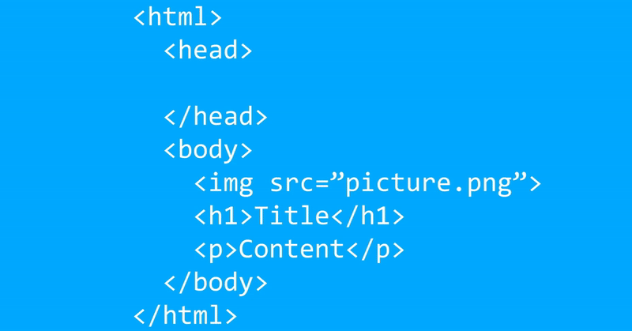
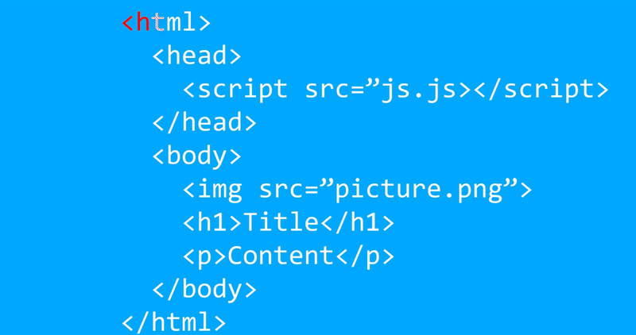

How many times have you written ``? Probably too many to count, but have you actually thought about how browsers handle that simple line of code? It is surprisingly more complex than it appears, which is why in this article I will be breaking down exactly how `script` tag loading works and most importantly how you can use `async` and `defer` to speed up your JavaScript load times.

*PS: This article is available in video form as well. This video is one of my better explanatory videos so I highly recommend you check it out if you are visual learner. [Click here to view the video.](https://youtu.be/Kpn2ajSa92c)*

## How The Browser Parses HTML

Before talking about speeding up `script` tag loading we first need to understand how the browser parses HTML. Luckily, for our purposes, it is pretty straight forward. The browser will parse HTML from the top of the document to the bottom, and when it hits a resource, like an `img` or `link` tag it will send out a request for that resource and continue parsing. The important thing to note is that the browser does not stop parsing the HTML to get the `img` `src`. This is why when you load a web page you may notice the page jumps around as the images pop in since they are loaded in the background and may finish downloading after the HTML is parsed. Below is an example of what the parsing looks like. The red highlighted text is code that has already been parsed. As you can see the parser does not stop on the `img` tag, and instead just keeps parsing.

Browsers parse `script` tags a bit differently, though. Instead of continuing to parse once a `script` tag is encountered, the browser instead stops parsing, downloads the JavaScript, and executes it. This is why many times developers will put their `script` tags at the bottom of the HTML body so they do not delay the parsing of the HTML. As you can see in the below image, when the `script` tag is reached the parser stops parsing and waits for the JavaScript to download. This can lead to slow page speeds if the JavaScript files are large.

You may see this and just think that putting `script` tags at the bottom of the HTML body is ideal, but if the HTML file is large then the JavaScript will not start downloading until all the HTML is parsed which could significantly delay the JavaScript download. This is why the `async` and `defer` attributes were created.

## Async Attribute Explained

The first attribute is the `async` attribute. To create an `async` `script` tag the following code is used ``. This attribute when applied to a `script` tag will make the `script` tag work just like `img` tags to the parser. This means the parser will download the JavaScript in the background and continue parsing as normal without waiting. When the JavaScript is done being downloaded then the parser will immediately stop parsing and execute the JavaScript. This is great for any small JavaScript code that is not dependent on anything else, but since the JavaScript is executed as soon as it is downloaded, the parser could still be delayed by JavaScript that takes a long time to execute. Another huge downside of the `async` attribute is that the JavaScript files are not executed in the order they are defined in the HTML. They are instead executed in the order they are downloaded. This means a quicker to download file will always execute before a slower to download file which can cause big problems if the JavaScript files are dependent on one another. Because of this, I rarely use `async` when loading `script` tags. The below video shows how the document is parsed when the `async` attribute is used.

## Defer Attribute Explained

Similar to the `async` attribute, the `defer` attribute will not stop parsing to download the JavaScript. To create a `defer` `script` tag the following code is used ``. The parser will download the JavaScript in the background and continue parsing, but unlike the `async` attribute, the `defer` attribute will not execute the JavaScript until after the entire HTML document is parsed. This means that with the `defer` attribute the HTML parsing will never be delayed by the downloading of JavaScript. Also, since the JavaScript is executed after the entire HTML document is parsed the order of the JavaScript files is maintained. This is because all `defer` attribute JavaScript files must be downloaded before any of them can be executed. Because of this, I love the `defer` attribute and use it pretty much every time I load JavaScript. This is because I can put my JavaScript in the head of my HTML so it starts downloading as soon as possible, and it also preserves the order of my JavaScript as if it was loaded without the `defer` attribute. Loading JavaScript with the `defer` attribute is essentially the same as loading JavaScript at the end of the body, but it will start the download sooner. Also, since the executing of the JavaScript is always done after the HTML is parsed, there is no need to wait for document ready events. The document will always be ready when a `defer` attributed `script` tag is executed. Below is a video of how the `defer` attribute works.

## Browser Support

Of course, when talking about cool features in web development we have to talk about the dreaded browser support. Luckily for us, `defer` and `async` have incredible browser support. At the time of posting this article the `defer` attribute has [97.5% support](https://caniuse.com/#feat=script-defer), and the `async` attribute has [97.3% support](https://caniuse.com/#feat=script-async). This is essentially the same level of support as flexbox which is amazing.

## Conclusion

In conclusion if you want to load JavaScript faster so your page can render quicker you need to be using `async` or `defer`. In general the `defer` attribute should be the go to since it works nearly identically to normal `script` tag loading, but in special circumstances `async` tags can be useful for speeding up your page load.